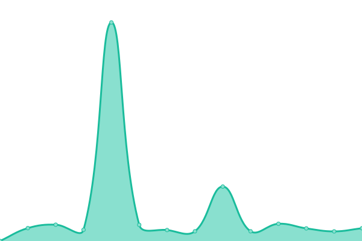
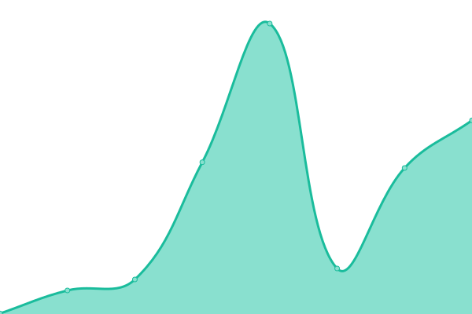

# [📈 Live Status](https://handy-sun.github.io/gh-uptime): <!--live status--> **🟩 All systems operational**

This repository contains the open-source uptime monitor and status page for [sooncheer](https://handy-sun.github.io/gh-uptime), powered by [Upptime](https://github.com/upptime/upptime).

With [Upptime](https://upptime.js.org), you can get your own unlimited and free uptime monitor and status page, powered entirely by a GitHub repository. We use [Issues](https://github.com/handy-sun/gh-uptime/issues) as incident reports, [Actions](https://github.com/handy-sun/gh-uptime/actions) as uptime monitors, and [Pages](https://handy-sun.github.io/gh-uptime) for the status page.

<!--start: status pages-->
<!-- This summary is generated by Upptime (https://github.com/upptime/upptime) -->
<!-- Do not edit this manually, your changes will be overwritten -->
<!-- prettier-ignore -->
| URL | Status | History | Response Time | Uptime |
| --- | ------ | ------- | ------------- | ------ |
|  [hals](https://hals.socool.ing/) | 🟩 Up | [hals.yml](https://github.com/handy-sun/gh-uptime/commits/HEAD/history/hals.yml) | 

 1002ms
     
 | 

<a href="https://handy-sun.github.io/gh-uptime/history/hals">98.77%</a>
    

|  [qbe](https://qbe.socool.ing/) | 🟩 Up | [qbe.yml](https://github.com/handy-sun/gh-uptime/commits/HEAD/history/qbe.yml) | 

 817ms
     
 | 

<a href="https://handy-sun.github.io/gh-uptime/history/qbe">99.06%</a>
    

|  [hemi](https://hemi.socool.ing/) | 🟩 Up | [hemi.yml](https://github.com/handy-sun/gh-uptime/commits/HEAD/history/hemi.yml) | 

 1173ms
     
 | 

<a href="https://handy-sun.github.io/gh-uptime/history/hemi">99.06%</a>
    

|  [als](https://als.socool.ing/) | 🟩 Up | [als.yml](https://github.com/handy-sun/gh-uptime/commits/HEAD/history/als.yml) | 

 1542ms
     
 | 

<a href="https://handy-sun.github.io/gh-uptime/history/als">99.06%</a>
    

|  [qb](https://qb.socool.ing/) | 🟩 Up | [qb.yml](https://github.com/handy-sun/gh-uptime/commits/HEAD/history/qb.yml) | 

 1202ms
     
 | 

<a href="https://handy-sun.github.io/gh-uptime/history/qb">98.16%</a>
    

|  [emi](https://emi.socool.ing/) | 🟩 Up | [emi.yml](https://github.com/handy-sun/gh-uptime/commits/HEAD/history/emi.yml) | 

 2235ms
     
 | 

<a href="https://handy-sun.github.io/gh-uptime/history/emi">99.05%</a>
    

|  [sst](https://sst.socool.ing/) | 🟩 Up | [sst.yml](https://github.com/handy-sun/gh-uptime/commits/HEAD/history/sst.yml) | 

 813ms
     
 | 

<a href="https://handy-sun.github.io/gh-uptime/history/sst">92.23%</a>
    

|  [Wikipedia](https://en.wikipedia.org) | 🟩 Up | [wikipedia.yml](https://github.com/handy-sun/gh-uptime/commits/HEAD/history/wikipedia.yml) | 

 98ms
     
 | 

<a href="https://handy-sun.github.io/gh-uptime/history/wikipedia">100.00%</a>
    

<!--end: status pages-->

[**Visit our status website →**](https://handy-sun.github.io/gh-uptime)

## 📄 License

- Powered by: [Upptime](https://github.com/upptime/upptime)
- Code: [MIT](./LICENSE) © [Anand Chowdhary](https://anandchowdhary.com), supported by [Pabio](https://pabio.com)
- Data in the `./history` directory: [Open Database License](https://opendatacommons.org/licenses/odbl/1-0/)
